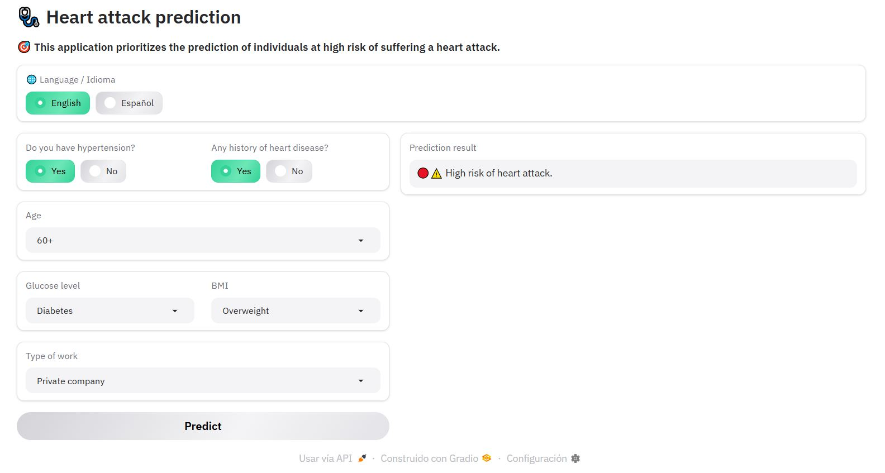

# Predicción de ataques cardíacos con Machine Learning

 📌 Disponible también en [Inglés](README.md) | 📌 Also available in [English](README.md)

Este proyecto aplica **técnicas de Machine Learning** para predecir la probabilidad de que una persona sufra un ataque cardiaco, utilizando datos médicos.

 💻 Desarrollado con Python, Gradio, scikit-learn, pandas, numpy, matplotlib.



### **📚 Demo del proyecto:** 
Presiona clic aquí para usarlo: [:heart: Predicción de ataques cardíacos](https://huggingface.co/spaces/diegosruiz18/heart-attack-prediction)  

En caso de no ver la aplicación, hacer clic en el botón **"Restart Space"**.

## Objetivo

Diseñar un modelo que clasifique a los pacientes como de **alto riesgo** o **bajo riesgo** de sufrir un ataque cardiaco, basándose en datos como edad, género, hipertensión, nivel de glucosa, IMC, entre otros.

### Descripción del dataset

| Nombre de la columna   | Descripción                                      |
|------------------------|----------------------------------------------------------------------------|
| ID                     | Identificador único de cada paciente.                                           |
| Genero                 | Género del paciente: `Hombre` o `Mujer`.                        |
| Edad                   | Edad del paciente en años.                                                      |
| Flag_hipertension      | Indica si el paciente tiene hipertensión (0 = No, 1 = Sí).                      |
| Flag_problem_cardiaco  | Antecedentes de enfermedad cardiaca (0 = No, 1 = Sí).                           |
| Estados_civil          | Estado civil: `Si` (Casado), `No` (Soltero).                               |
| Tipo_trabajo           | Tipo de empleo: empresa privada, gobierno, nunca trabajó, etc.                  |
| Zona_residencia        | Zona de residencia: urbana o rural.                                             |
| Promedio_nivel_glucosa | Nivel promedio de glucosa en sangre.                                            |
| IMC                    | Índice de Masa Corporal.                                                        |
| Flag_fumador           | Estado de fumador: fumador, nunca fumó, exfumador.                              |
| Ataque_cardiaco        | **Variable objetivo**: indica si sufrió un ataque cardiaco (`1`) o no (`0`).   |

### ¿Cómo usarlo?

- Elegir el idioma de la aplicación (por defecto en Inglés).
- Seleccionar todos los campos del formulario.
- Hacer clic en el botón **Predecir**, si no ha completado todos los campos del formulario aparecerá una alerta que le solicitará completarlo.
- Visualizar el resultado de la predicción.

## Desarrollo

### **Exploración de datos**
- Matriz de datos nulos con `missingno`.
- Visualización del desbalance de clases (variable objetivo). 
- Distribuciones de valores.

### **Preprocesamiento de datos**
- Imputación de la columna IMC.
- Transformación de variables (codificación).  

### **Entrenamiento de modelos**
- División y balanceo del dataset con SMOTE.  
- Modelos entrenados: **Random Forest** y **XGBoost**.  
- Evaluación del rendimiento: `accuracy`, matriz de confusión, y reporte de clasificación.
- Exportación del modelo de `RandomForestClassifier`.
  
### **Aplicación web y despliegue**
- Creación de una aplicación web con Gradio en ```app.py```.
- Despliegue de la aplicación en Hugging Face.

## Aprendizajes clave
- SMOTE es altamente efectivo para abordar el desbalance de clases en datos médicos. 
- La limpieza de datos y selección de variables son esenciales en analítica del campo salud.
- En este contexto, priorizando la predicción de ocurrencia de ataques cardiacos el modelo Random Forest tiene mayor precisión.

## Archivos
- `heart_attack_prediction.ipynb`: Notebook con documentación bilingüe.
- `heart_attack_rf_model.pkl`: Modelo de Random Forest exportado.
- `app.py`: Aplicación en Gradio.
- `Dataset_Infartos.csv`: Dataset de entrada.

## Tecnologías, técnicas y algoritmos utilizados
- **Tecnologías:** Python, Google Colab, Gradio.
- **Técnicas:** Limpieza de datos, SMOTE, entrenamiento y evaluación de modelos. 
- **Algoritmos:** `RandomForestClassifier`, `XGBoostClassifier`.