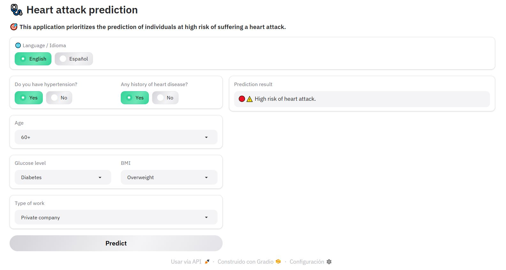

# Heart attack prediction with Machine Learning

📌 Also available in [Spanish](README.es.md) | 📌 Disponible también en [Español](README.es.md)

This project applies **Machine Learning techniques** to predict the probability of a person experiencing a heart attack, based on real medical data.

💻 Built using Python, Gradio, scikit-learn, pandas, numpy, matplotlib.



### **📚 Project demo:** 
Click here to use it: [:heart: Heart Attack Prediction](https://huggingface.co/spaces/diegosruiz18/heart-attack-prediction)

Click the **"Restart Space"** button if the application does not appear.

## Objective

The objective of this project is design a model that can classify patients as **high-risk** or **low-risk** for heart attacks, using medical data including age, gender, hypertension, glucose levels, BMI, etc.

### Dataset description

| Column name              | Description                                                                 |
|--------------------------|-----------------------------------------------------------------------------|
| ID                     | Unique identifier for each patient.                                         |
| Genero                 | Gender of the patient: `Male` or `Female`                |
| Edad                   | Age of the patient in years.                                                |
| Flag_hipertension      | Whether the patient has hypertension (0 = No, 1 = Yes).                 |
| Flag_problem_cardiaco  | Whether the patient has a history of heart disease (0 = No, 1 = Yes).    |
| Estados_civil          | Marital status: `Si` (Married), `No` (Single).           |
| Tipo_trabajo           | Type of employment: private company, government, never worked, etc.     |
| Zona_residencia        | Area of residence: urban or rural.                             |
| Promedio_nivel_glucosa | Average blood glucose level.                                                |
| IMC                    | Body Mass Index.                                                      |
| Flag_fumador           | Smoking status: smoker, never, former smoker.                   |
| Ataque_cardiaco        | **Target variable**: whether the patient suffered a heart attack (`1`) or not (`0`). |

### How to use it?

- Choose the application language (default: English).
- Fill in all the form fields.
- Click the **Predict** button, if any field is missing an alert will appear you to complete the form.
- View the prediction result.

## Development

### **Data exploration**
   - Missing data matrix with `missingno`.
   - Class imbalance visualization (target variable).
   - Value distributions.

### **Data preprocessing**
   - Impute "IMC" column.
   - Variable Transformation (encoding).

### **Model training**
   - Data split and balancing with SMOTE.
   - XGBoost and Random Forest models.
   - Performance evaluation: accuracy, confusion matrix, classification report.
   - Export the `RandomForestClassifier` model.

### **Web application and deployment**
   - Creation of a web application with Gradio in ```app.py```.
   - Deployment of the application on Hugging Face.

## Key learnings
- SMOTE is highly effective in dealing with class imbalance in medical datasets.
- Importance of data cleaning and variable selection in healthcare analytics.
- In this context, prioritizing the prediction of heart attack occurrence, the Random Forest model has higher precision.

## Files
- `heart_attack_prediction.ipynb`: Complete notebook with bilingual documentation.
- `heart_attack_rf_model.pkl`: Exported Random Forest model.
- `app.py`: Gradio application.
- `Dataset_Infartos.csv`: Input dataset.

## Technologies, techniques and algorithms used
- Technologies: Python, Google Colab, Gradio.
- Techniques: Data cleaning, SMOTE, model training and evaluation.
- Algorithms: `RandomForestClassifier`, `XGBoostClassifier`.